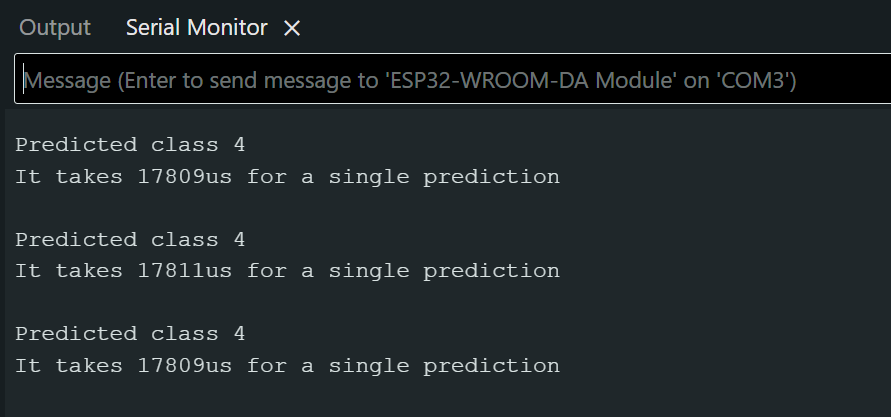

# Handwritten Digit Recognition on ESP32 using TensorFlow Lite

This project aims to implement a neural network model for handwritten digit recognition on an ESP32 microcontroller using TensorFlow Lite (TFLite). The model trained on the MNIST dataset, was optimized and converted to TFLite format. The deployment of this model on the ESP32 enable real-time digit recognition with high accuracy and low power consumption using TinyML, demonstrating the potential of integrating machine learning with low-cost, low-power hardware for embedded applications.

## Project Overview

- **Model**: A simple neural network trained on MNIST (`28x28` grayscale digits, 10 classes).
- **Deployment**: The trained `.tflite` model is converted into a C header and run on the ESP32 using [EloquentTinyML]
- **Inference**: Classification is done onboard with results output via serial.

---

## Model Architecture

```
Input: 784 (28x28 image flattened)
|-- Dense(128, activation='relu')
|-- Dense(10, activation='softmax')
Output: 10 classes (digits 0-9)
```

## Results


